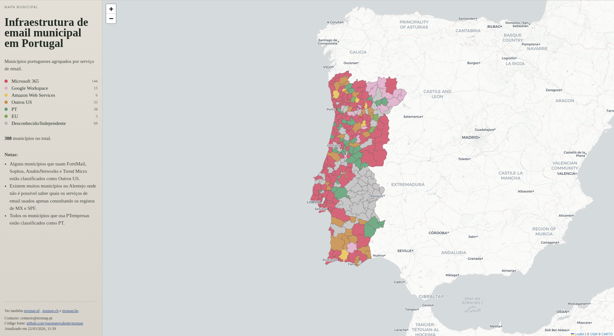

# MXmap — E-mail providers of Portuguese municipalities

> **This is a fork of [mxmap.ch](https://mxmap.ch) by [David Huser](https://github.com/davidhuser/mxmap).**
>
> This repository adapts that work for Portugal — changing Swiss municipality data sources, DNS classification logic, and map boundaries to Portuguese equivalents.
>

An interactive map showing where Portuguese municipalities host their email — whether with US hyperscalers (Microsoft, Google, AWS), Portuguese providers, EU providers, or independent solutions.

**[View the live map](https://mxmap.pt)**



## How it works

The data pipeline has three steps:

1. **Preprocess** — Loads municipalities from `websites.json`, matches them with `municipalities-portugal.geojson` codes/districts, performs MX and SPF DNS lookups on official domains, and classifies each municipality's email provider.
2. **Postprocess** — Applies manual overrides for edge cases, retries DNS for unresolved domains, checks SMTP banners of independent MX hosts for hidden providers, then scrapes websites of still-unclassified municipalities for email addresses.
3. **Validate** — Cross-validates MX and SPF records, assigns a confidence score (0–100) to each entry, and generates a validation report.

```mermaid
flowchart TD
    trigger["Nightly trigger"] --> websites
    trigger --> boundaries

    subgraph pre ["1 · Preprocess"]
        websites[/"websites.json"/] --> match["Match municipality names<br/>to official codes"]
        boundaries[/"municipalities-portugal.geojson"/] --> match
        match --> domains["Extract domains +<br/>guess candidates"]
        domains --> dns["MX + SPF lookups<br/>(3 resolvers)"]
        dns --> spf_resolve["Resolve SPF includes<br/>& redirects"]
        spf_resolve --> cname["Follow CNAME chains"]
        cname --> asn["ASN lookups<br/>(Team Cymru)"]
        asn --> autodiscover["Autodiscover DNS<br/>(CNAME + SRV)"]
        autodiscover --> gateway["Detect gateways<br/>(SeppMail, Barracuda,<br/>Proofpoint, Sophos ...)"]
        gateway --> classify["Classify providers<br/>MX → CNAME → SPF → Autodiscover → SMTP"]
    end

    classify --> overrides

    subgraph post ["2 · Postprocess"]
        overrides["Apply manual overrides"] --> retry["Retry DNS<br/>for unknowns"]
        retry --> smtp["SMTP banner check<br/>(EHLO on port 25)"]
        smtp --> scrape_urls["Probe municipal websites<br/>(/contact, /kontakt, /bestuur …)"]
        scrape_urls --> extract["Extract emails<br/>+ decrypt TYPO3 obfuscation"]
        extract --> scrape_dns["DNS lookup on<br/>email domains"]
        scrape_dns --> reclassify["Reclassify<br/>resolved entries"]
    end

    reclassify --> data[("data.json")]
    data --> score

    subgraph val ["3 · Validate"]
        score["Confidence scoring · 0–100"] --> gwarn["Flag potential<br/>unknown gateways"]
        gwarn --> gate{"Quality gate<br/>avg ≥ 70 · high-conf ≥ 80%"}
    end

    gate -- "Pass" --> deploy["Commit & deploy to Pages"]
    gate -- "Fail" --> notify["Notify via failed CI"]

    style trigger fill:#e8f4fd,stroke:#4a90d9,color:#1a5276
    style websites fill:#e8f4fd,stroke:#4a90d9,color:#1a5276
    style boundaries fill:#e8f4fd,stroke:#4a90d9,color:#1a5276
    style data fill:#d5f5e3,stroke:#27ae60,color:#1e8449
    style deploy fill:#d5f5e3,stroke:#27ae60,color:#1e8449
    style notify fill:#fadbd8,stroke:#e74c3c,color:#922b21
    style gate fill:#fdebd0,stroke:#e67e22,color:#935116
```



## Quick start

```bash
# Python 3.13+
uv sync

uv run preprocess
uv run postprocess
uv run validate

# Serve the map locally
python -m http.server
```

Open `http://localhost:8000`.

## CLI commands

The project exposes three entrypoints via `pyproject.toml`:

- `uv run preprocess` -> creates/refreshes `data.json`
- `uv run postprocess` -> enriches classifications and applies overrides
- `uv run validate` -> writes `validation_report.csv` and `validation_report.json` and enforces quality gates

## Data files

- `data.json`: primary map dataset and provider counts
- `validation_report.csv`: row-level validation output
- `validation_report.json`: machine-readable validation summary
- `websites.json`: primary municipality/domain source for preprocess
- `municipalities-portugal.geojson` and `gemeente_2025.topojson`: map boundaries

## Development

```bash
uv sync --group dev

# Run tests with coverage
uv run pytest --cov --cov-report=term-missing

# Lint the codebase
uv run ruff check src tests
uv run ruff format src tests
```

## Original project

This is a fork of **[mxmap.ch](https://mxmap.ch)** ([source](https://github.com/davidhuser/mxmap)) by David Huser, who built the original map for ~2100 Swiss municipalities. The pipeline design, classification logic, and frontend are his work. Go star his repo.

## Related work

* [hpr4379 :: Mapping Municipalities' Digital Dependencies](https://hackerpublicradio.org/eps/hpr4379/index.html) — David Huser's talk about the original project
* if you know of other similar projects, please open an issue or submit a PR!

## Contributing

If you spot a misclassification, please open an issue with the municipality code and the correct provider.
For municipalities where automated detection fails, corrections can be added to the `MANUAL_OVERRIDES` dict in `src/mail_sovereignty/postprocess.py`.

When proposing a change, please include:

- municipality code and name
- expected provider and a short justification (MX/SPF evidence)
- sample DNS records or domains used to validate the change